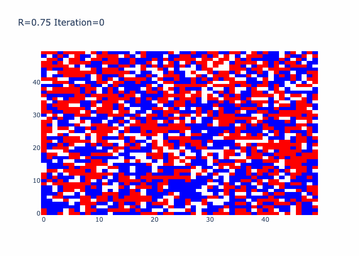

### HW3 - Schelling model
[Source of plots](out)

Different R plots:
1. R=0:

2. R=0.125:

3. R=0.250:

4. R=0.375:

5. R=0.500:

6. R=0.625

7. R=0.750

8. R=0.875

9. R=0.1

Number of dissatisfied agents:

