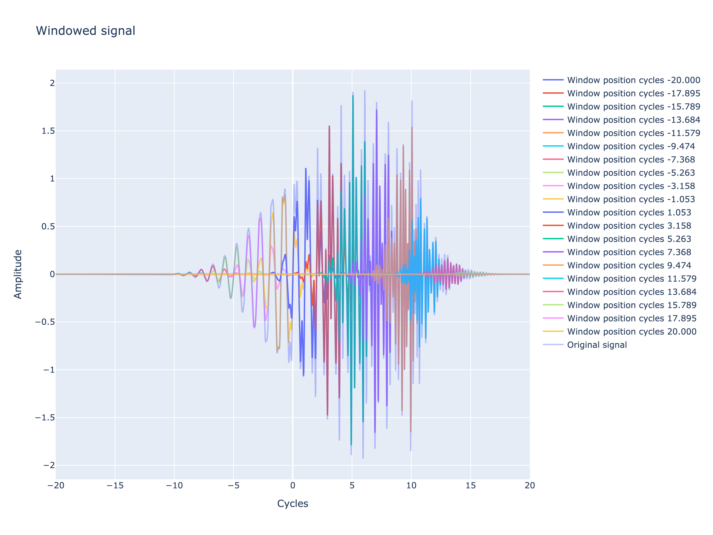

### HW3 - Schelling model
[Source of plots](out)

Base signal:

Base fft:

Base signal + frequency = 4 and time_shift = 7 cycles:

Base signal + frequency = 4 and time_shift = 7 cycles fft:

Window function for different position:

Window function applied to signal:

Spectrogram:

FFT time measure:

**Question:** Measure the timing, can you explain the difference between speed of FFT for different sample size? Write something as a possible explanation. (2 points)

**Answer:**
The Fast Fourier Transform (FFT) can achiлeve the best 
performance using a divide-and-conquer approach when you 
split the sequence into two parts and apply the algorithm to each part. 
If your sequence has a length that is a power of 2, you can efficiently split this sequence into two parts until the sequence length is reduced to 1