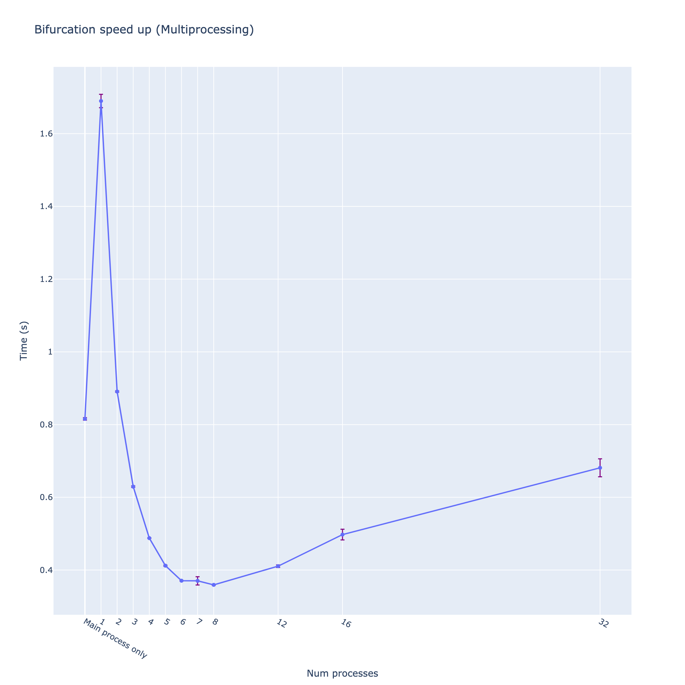

### HW5 - Parallel bifurcation map and spectrogram
```bash
python hw5/main.py
```
[Source of plots](out)

**Threads vs. Processes**

For the bifurcation map, I use multiprocessing because most of the code is written in pure Python. Due to the Global Interpreter Lock (GIL), multithreading does not improve the execution speed. For the spectrogram, I use multithreading because most of the computational functions rely on NumPy. Since NumPy bypasses the GIL, we can achieve a speedup by using threads instead of processes.

My PC has 6+2 cores:


Bifurcation Speedup:

 

Bifurcation for Multiprocessing and Single Process:

 

Spectrogram for Multiprocessing and Single Process:

 