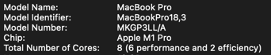
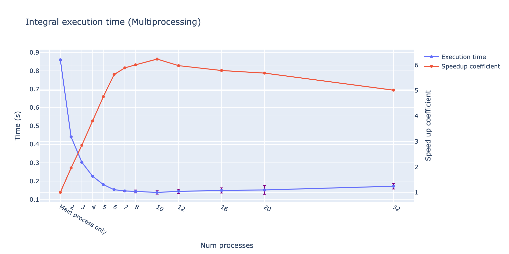
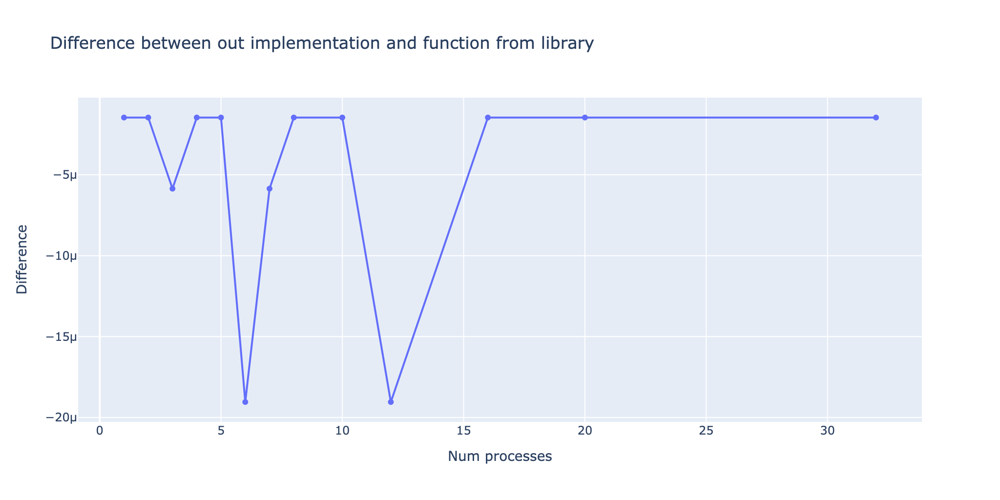

### HW6 - Integral
```bash
python hw6/main.py
```
[Source of plots](out)

**Threads vs. Processes**

My PC has 6+2 cores:



Integral Speedup:



Difference between sequential version and parallel version:



