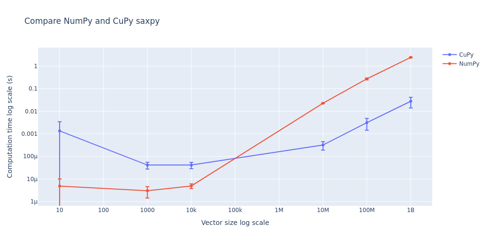
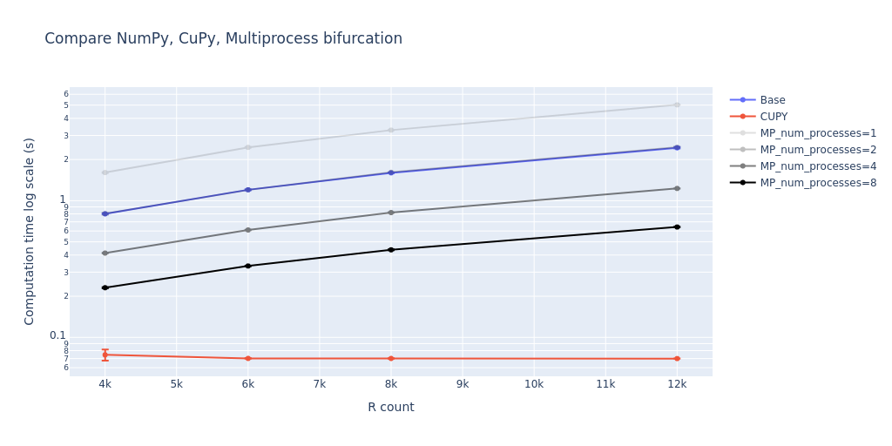
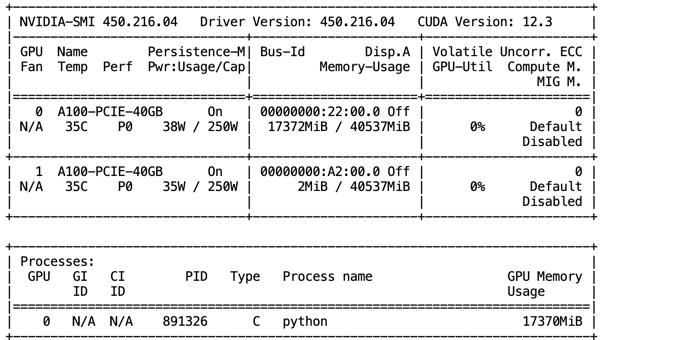

### HW9 - Saxpy + CuPy Bifurcation
[Source of plots](out)

**Question:** An explanation is given of what is the difference between cupy and numpy. How does cupy handle data transfers between CPU and GPU? (1 point)

**Answer:** CuPy performs all operations on the GPU by default. To transfer data to the GPU, simply initialize a cp.ndarray. If you need to move the data back to the host, call the get() function, which creates a NumPy array on the host device.

SAXPY speed compare:

Bifurcation speed compare:

GPU config:

